# 实际教程

- 买个二手苹果手机可以用esim卡，开通网络支付能订酒店和买车票
- 准备好往返机票、酒店订单
- 从香港出镜，转机波黑的萨拉热窝
- 大克拉杜莎边境小镇，前面有一条河，越过那条河就到克罗地亚的小镇。卡尔洛维克

## 工具&提示
- 欧洲巴士查询网站 - https://global.flixbus.com/
- 龙门客栈
- 落地后再买装备。海关会检查
- 直飞波斯尼亚黑塞哥维那或者塞尔维亚
- 不要加微信群、被监控
- 花点钱找舌头买线

## 防抓
- 有热成像仪、无人机
- 靠近边境线前，把手机卡拔掉，以免被边巡警察监测到手机基站信号。
- 下山后丢掉或者藏好登山装备，以免被发现走线
- 注意司机举报、居民举报
- 被抓则砸手机。没收装备，或毒打。逃跑则有警犬追。送回出发国边境

## **装备**

- 登山包 20L
- 充电宝
- 头灯
- 冲锋衣
- 速干衣
- 防水登山靴 爬雪山
- 手套
- 能量棒
- 地图
- 指南针
- 失温急救毯
- 欧标插头转换器

## 路线
土耳其-塞尔维亚-波黑-克罗地亚-斯洛文尼亚-意大利-德国

## 其他技巧
- 凌晨坐车
- 晚上走，见车藏起来。白天藏山里。到戈斯皮奇坐车

## 实际图

### 萨拉热窝机场
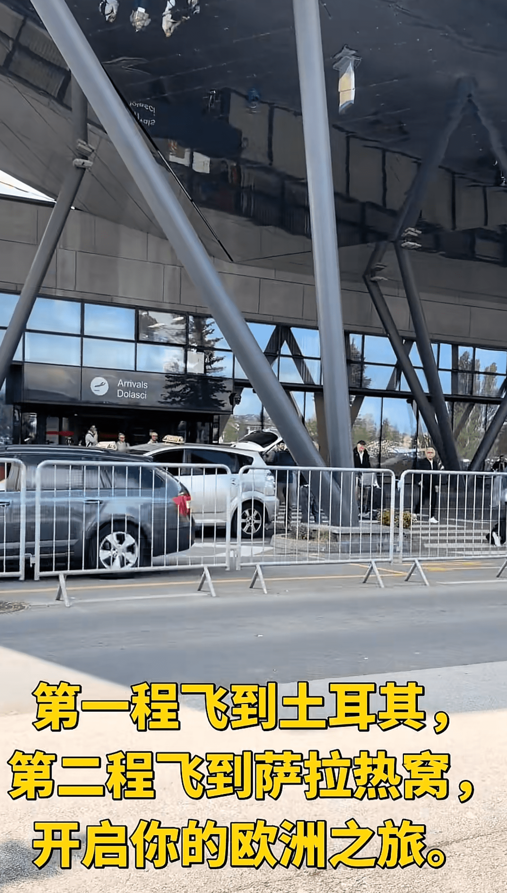

### 波黑
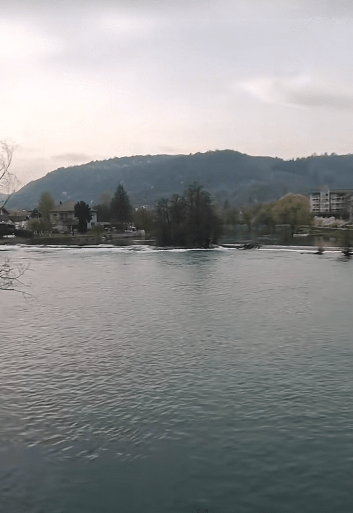

### 龙门客栈

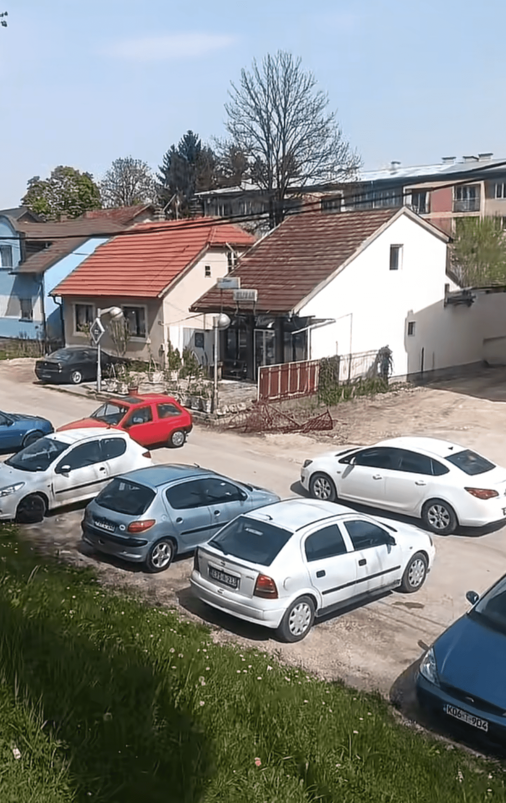
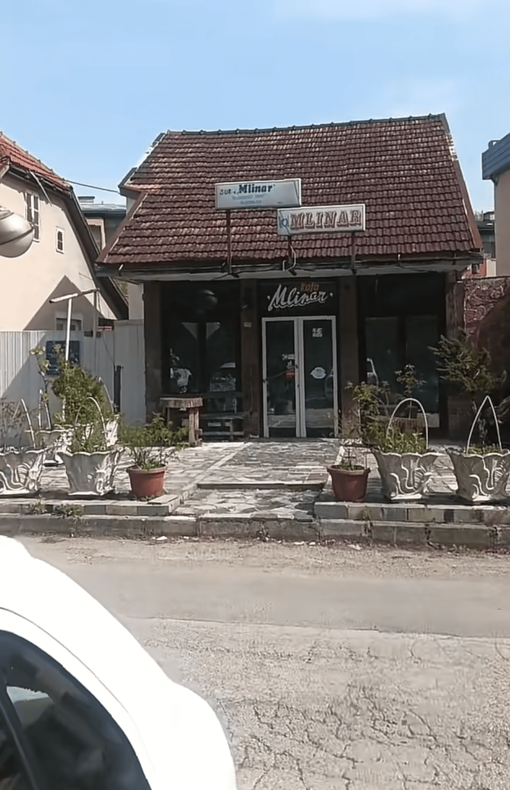

### 出发点
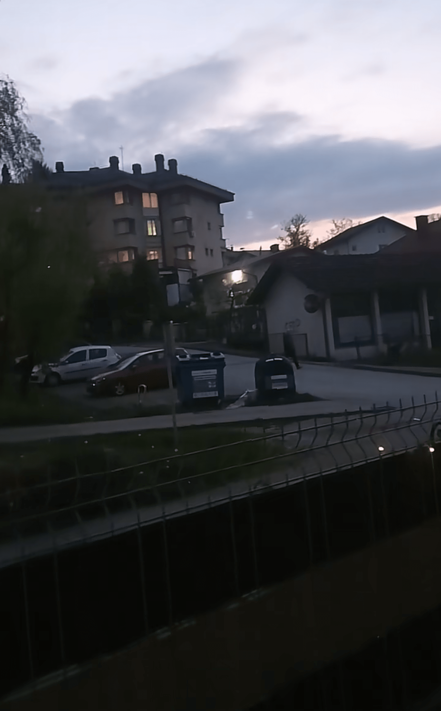

### 克罗地亚
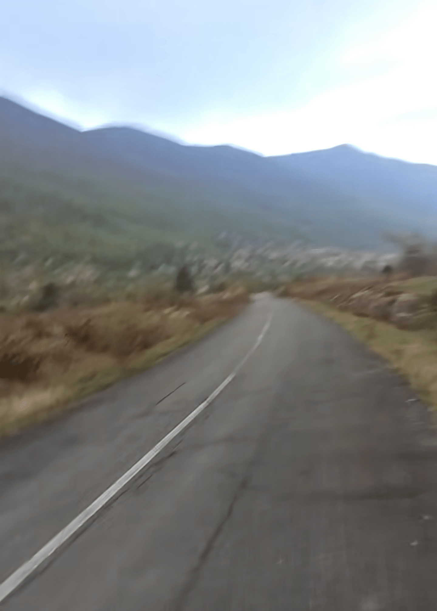
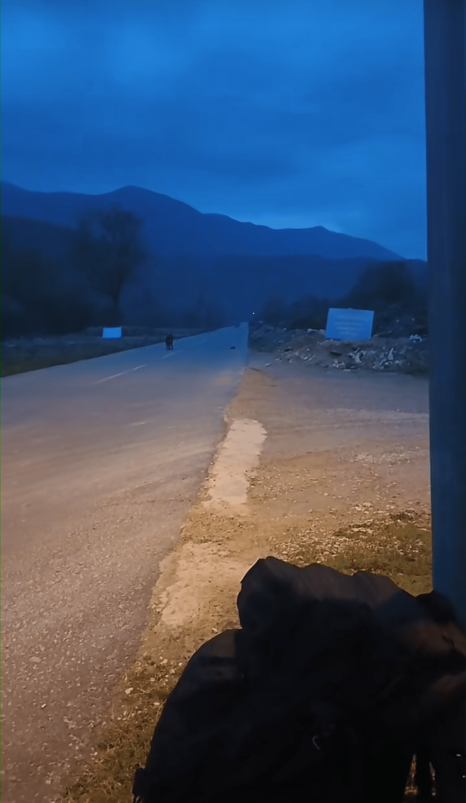
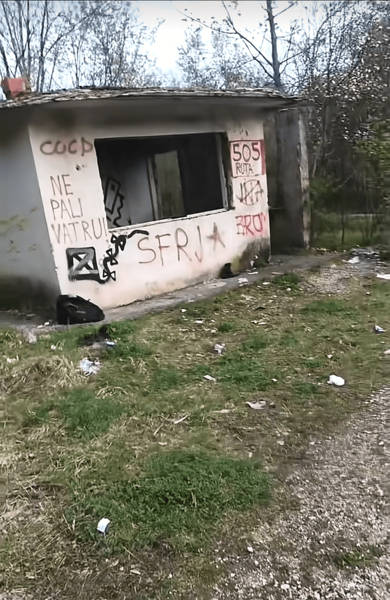
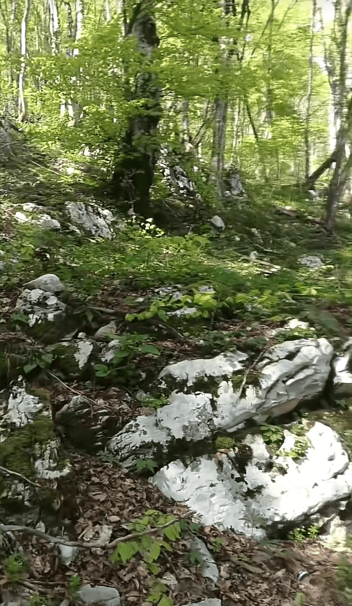

### 萨格拉布汽车站 -> 里耶卡
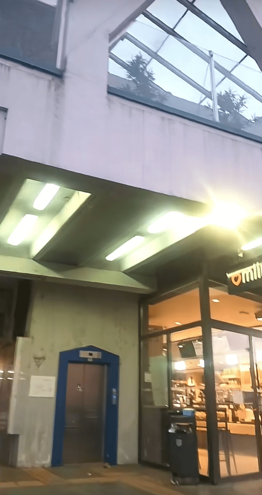

### 斯洛文尼亚 边境线铁路
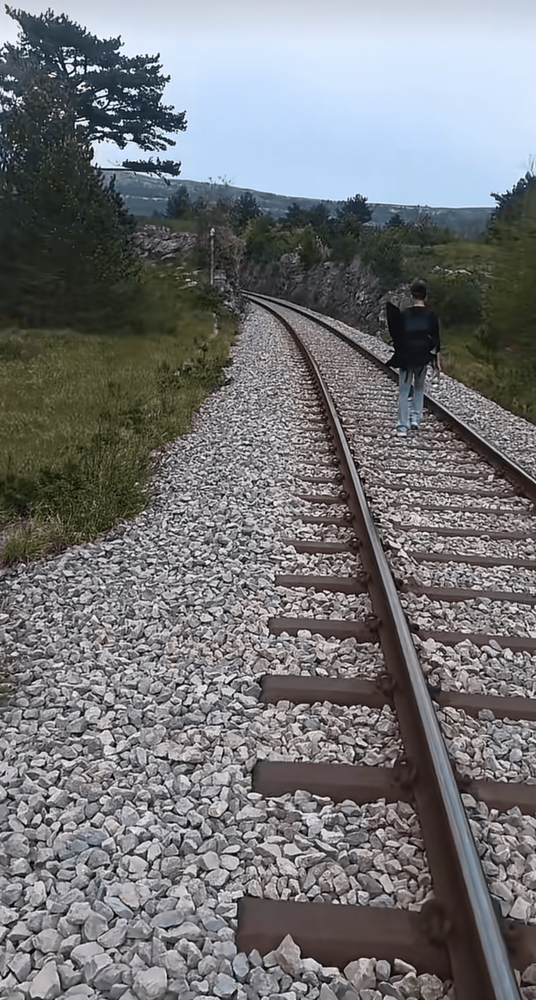
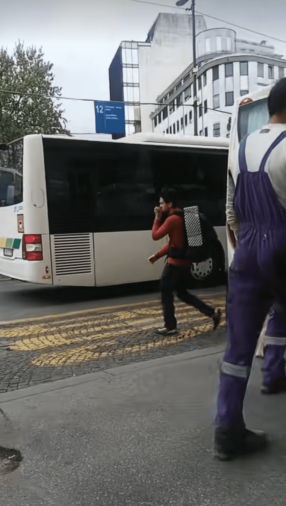

## 路线
香港出境 -> 波黑 萨拉热窝 -> 波黑 比哈奇 -> 克罗地亚 Jezerce -> 克罗地亚 萨格勒布 -> 斯洛文尼亚 布雷日采 -> 斯洛文尼亚 卢布尔雅那 -> 斯洛文尼亚 新戈里卡 -> 意大利 戈里奇亚 -> 意大利 威尼斯 -> 意大利 米兰 -> 瑞士 苏黎世 -> 德国 斯图加特 -> 德国 海德堡

比哈奇 -> 戈斯皮奇 -> 里耶卡 -> 斯洛文尼亚的卢布尔雅那 -> 意大利 -> 意大利米兰 -> 德国

## 大概路线

**克罗地亚路段：**

- 比哈奇边境到克罗地亚境内大巴上车点（6:45、17:30），
- 上车过后坐到终点站到萨格勒布，然后导航到最近的麦当劳。
- 在麦当劳手机上叫出租车坐车到克罗地亚与斯洛文尼亚边境小木屋躲着！

**斯洛文尼亚路段：**
- 晚上从小木屋出发，直接从小木屋走到这个对面亮灯的马路方向。
- 途中遇到小溪，跟着小溪左边一直走，走到尽头会遇到一个10多米的桥。
- 翻到桥上，穿过桥立马右拐。
- 走小路到巴士站
- 巴士站坐到斯洛文尼亚的卢布尔雅那汽车站
- 做大巴到新戈里卡（新戈里察）
- 下大巴到麦当劳
- 从麦当劳走路到教堂，
- 到教堂门口右拐从小路导航去火车站
- 到达火车站意大利边境火车站，坐火车去威尼斯！
