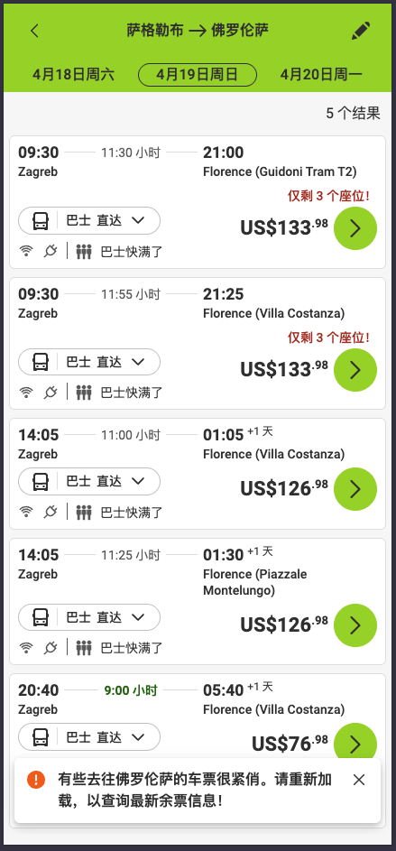

# 实际教程

## 工具&提示
- 欧洲巴士查询网站 - https://global.flixbus.com/
- 龙门客栈
- 落地后再买装备。海关会检查
- 直飞波斯尼亚黑塞哥维那或者塞尔维亚
- 不要加微信群、被监控
- 花点钱找舌头买线

## 防抓
- 有热成像仪、无人机
- 靠近边境线前，把手机卡拔掉，以免被边巡警察监测到手机基站信号。
- 下山后丢掉或者藏好登山装备，以免被发现走线
- 注意司机举报、居民举报
- 被抓则砸手机。没收装备，或毒打。逃跑则有警犬追。送回出发国边境

## **装备**

- 登山包 20L
- 充电宝
- 头灯
- 冲锋衣
- 速干衣
- 防水登山靴 爬雪山
- 手套
- 能量棒
- 地图
- 指南针
- 失温急救毯

## 路线
土耳其-塞尔维亚-波黑-克罗地亚-斯洛文尼亚-意大利-德国
