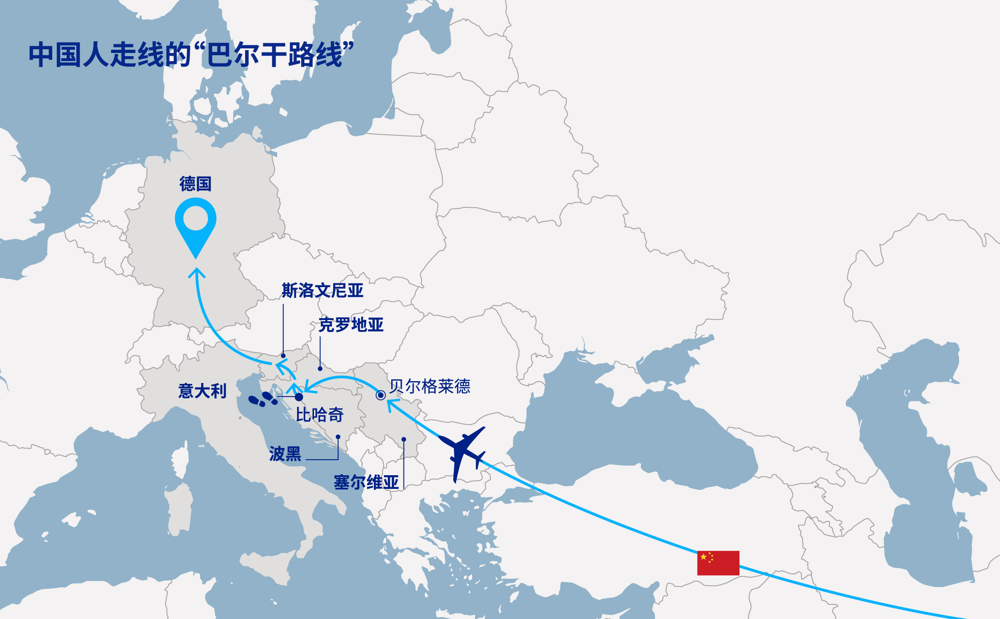

# 走线德国

走线欧洲的中国人大多先飞到塞尔维亚的首都贝尔格莱德，再坐大巴取道波黑。  
他们在波黑边境城市比哈奇徒步穿越山林，进入邻国克罗地亚。  
位于东欧的塞尔维亚与波黑都对中国公民免签，而比邻的克罗地亚则属于申根地区（包括欧盟大部分地区以及挪威和瑞士等几个非欧盟成员国），也是欧盟成员国之一，从该国前往其他申根国家一般不需要出示护照或接受边境检查。  
走线人在抵达克罗地亚腹地之后，再搭乘火车、汽车经斯洛文尼亚、意大利继续西行。

疫情期间，  
中国走线客选择走拉丁美洲路线赴美，  
不过这条路线如今已被川普政府封堵。

如今，  
中国走线客又开辟了一条去德国的新路线，

数据显示，近5年来，  
在德国申请庇护的中国人人数持续攀升，  
今年1到11月，就有约1600人提出申请，  
创近年来新高。  

具体路线：  
先飞到塞尔维亚——  
搭大巴到波黑——  
徒步穿越山林到达克罗地亚——  
再搭乘火车、汽车，  
经斯洛文尼亚、意大利继续西行，  
最后到终点站德国。  

抖音上，  
有一些走线客分享教程心得。  
一名走线德国的国人称：  
“2号就到德国了，  
直接先去报的营，  
大营一个月还给发140欧元。”

